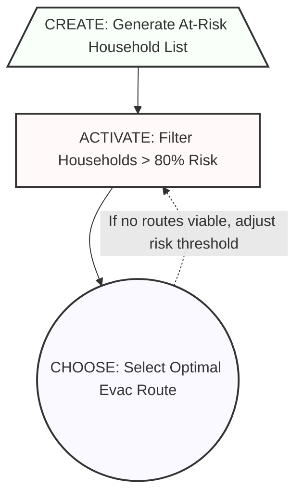

You are rendering an already-classified set of CHOOSE/ACTIVATE/CREATE decisions as a Mermaid directed graph. Read `.github/skills/revisit-skill-core/references/typology.md` now. **This is a rendering step, not an entry point** — it turns an existing spec into a visual, it does not do the classification itself.

## When to invoke

Only after `decision-task-abstraction` and/or `decision-task-hierarchy` has already produced a `public/<studyName>/design/decision-abstraction.md` or `decision-hierarchy.md`. If neither file exists yet, stop and tell the user to run `decision-task-abstraction` (for a flat task list) or `decision-task-hierarchy` (for a multi-level tree) first — don't improvise a classification here just to have something to diagram.

## Workflow

1. **Locate the source file.** Ask which study, then check for `public/<studyName>/design/decision-abstraction.md` and `decision-hierarchy.md`. If both exist, ask the user which to render (or render both as separate diagrams). If neither exists, stop per above.
2. **Extract nodes.** For each decision/task entry in the source file, note its name, type (CHOOSE/ACTIVATE/CREATE), and its stated input/output relationships to other tasks (the "feeds into" / "depends on" info already captured in the source file's fields).
3. **Map types to shapes**:
   - **CHOOSE** → circle: `id((CHOOSE: <name>))`
   - **ACTIVATE** → square/bracket: `id[ACTIVATE: <name>]`
   - **CREATE** → trapezoid: `id[/CREATE: <name>\]`
4. **Draw directed edges** for each input/output relationship found in the source file (output of task A → input of task B).
5. **Add iteration back-edges** where the source file's "output guarantees" note a fallback (e.g. ACTIVATE returning zero options looping back to adjust a threshold or re-run an earlier CREATE step) — use a dotted edge with a label describing the trigger condition.
6. **Confirm the shape/edge mapping reads correctly** with the user before writing — a diagram that silently drops a dependency is worse than no diagram.

## Output

**Append**, don't create a new file — add a `## Decision Diagram` section to the end of the source file that was rendered (`decision-abstraction.md` or `decision-hierarchy.md`):

````markdown
## Decision Diagram


````

If the section already exists (re-rendered after the source file was updated), replace it in place rather than appending a duplicate.

## Common pitfalls

- **Diagramming UI clicks instead of decisions.** Only diagram the cognitive/computational evaluation nodes already present in the source file — don't add nodes for "click button" or "open menu" that aren't decisions in the source spec.
- **Missing iteration edges.** If the source file documents a zero-return or re-evaluation fallback, it must appear as a back-edge — omitting it makes the diagram look like a one-shot pipeline when the actual decision process is cyclic (design goal G1 in the typology).
- **Re-classifying instead of rendering.** If a task in the source file seems misclassified while diagramming, don't silently "fix" it here — flag it to the user and point them back to `decision-task-abstraction`/`decision-task-hierarchy` to correct the source.
